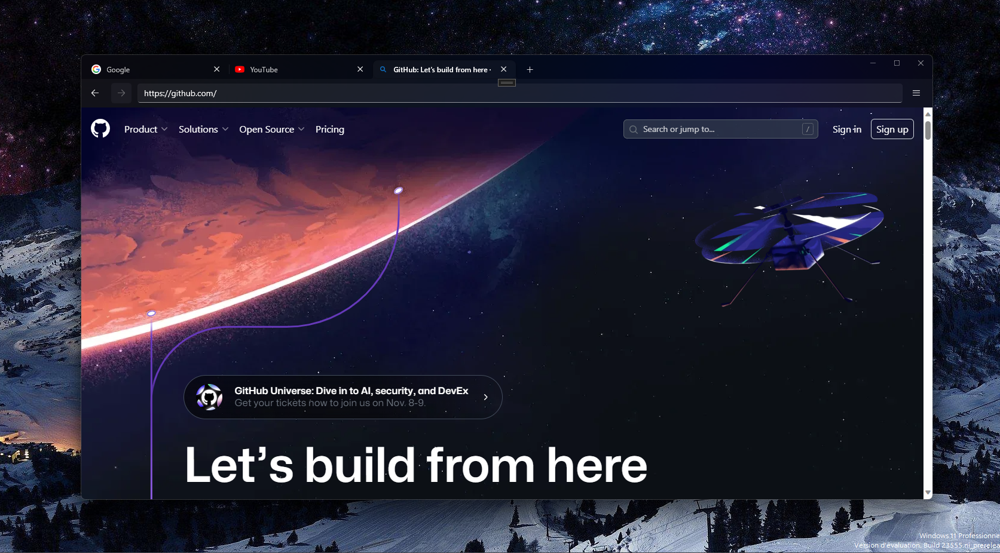

# Browse
Browse is a web browser with a consistent UI built on top of Microsoft's WebView2

## Screenshot

## FAQ
### Where i can download it?
You need to compile the source code. see the Build section below

### Why it doesn't have an icon?
I didn't make an icon

## Build Browse
### Required

Required:
* Visual Studio 2022 with .NET workflow & the WinUI 3 project option enabled.
* Windows Developer Mode enabled

### Step 1 : Clone the repo
aka run `git clone https://github.com/RaphMar2021/Browse` in a command prompt

### Step 2 : Build & Deploy Browse to your PC
* Open VS2022
* Open the .sln file defining the Browse's solution
* Click 'Run', or press 'F5'. It will build, deploy, then debug Browse.
* Close the Browse window.

Now, Browse is installed on your PC
